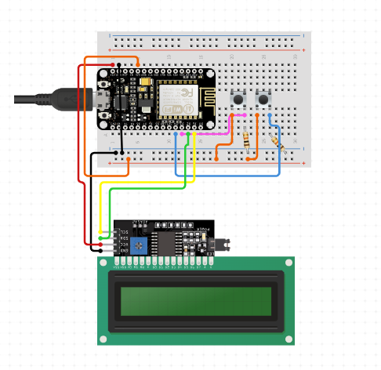
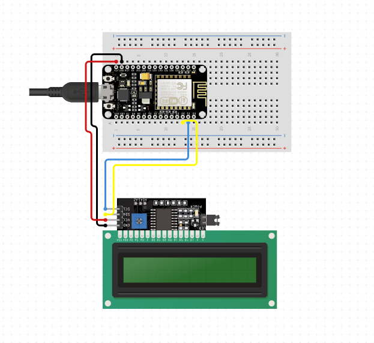
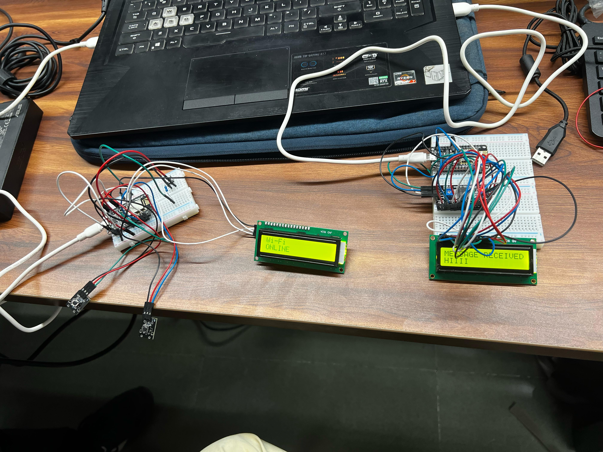
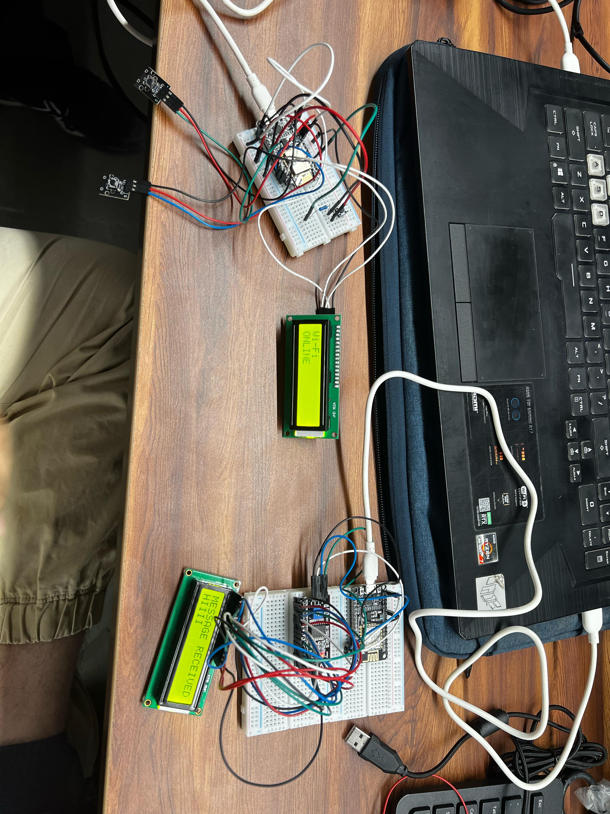

# NodeMCU Pager Project

## Overview

This project utilizes NodeMCU to create a wireless pager system. The NodeMCU microcontroller is programmed to receive signals and trigger a notification, making it an ideal solution for various applications such as home automation or office alert systems.

## Circuit Diagram

The circuit consists of the following components:

- NodeMCU (ESP8266) microcontroller
- Push button for input
- LED for visual indication
- Other necessary passive components

## Getting Started

Follow these steps to set up the NodeMCU Pager Project:

1. **Download and Install Arduino IDE:**
   - Install the Arduino IDE on your computer.
   - Add the ESP8266 board to the Arduino IDE.

2. **Download NodeMCU Pager Code:**
   - Clone or download the NodeMCU Pager code from the project repository.

3. **Connect the Components:**
   - Refer to the circuit diagram to connect the NodeMCU, push button, LED, and other components.

4. **Upload Code to NodeMCU:**
   - Open the NodeMCU Pager code in Arduino IDE.
   - Configure the necessary settings (Wi-Fi credentials, etc.).
   - Upload the code to the NodeMCU.

5. **Test the Pager:**
   - Press the button connected to the NodeMCU.
   - Verify that the LED lights up and any configured notification is triggered.

## Final Project Photo

This image showcases the completed NodeMCU Pager project with all components assembled and operational.

## Additional Information

- The code is designed to be easily customizable. Feel free to modify it to suit your specific requirements.
- Ensure that the NodeMCU is connected to a stable Wi-Fi network for reliable operation.
- Check the serial monitor for debugging information during testing and troubleshooting.

## License

This project is licensed under the [MIT License](LICENSE.md) - see the [LICENSE.md](LICENSE.md) file for details.

## Acknowledgments

- Thanks to the NodeMCU community for their valuable resources and support.

Feel free to contribute to the project or provide feedback!
